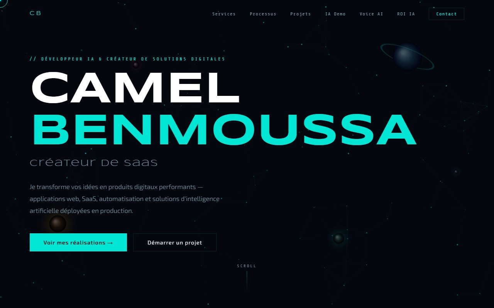

# Camel Benmoussa — Portfolio

Portfolio personnel en ligne : **[benmoussa-consulting.fr](https://benmoussa-consulting.fr)**

Développeur IA & créateur de solutions digitales — SaaS, automatisation, intelligence artificielle.

---

## Aperçu



Site statique avec animations scroll, particules canvas, voix IA et sections ROI interactives.

---

## Fonctionnalités

- **Hero animé** — canvas particles + planètes avec halos, animation RAF
- **Scroll vidéo** — séquence de 160 frames JPEG scrubbing au scroll (style Apple)
- **Voix IA** — lecture d'une présentation audio générée par Gemini 2.5 Flash (voix Orus)
- **Chat IA démo** — interface de démonstration intégrée
- **ROI IA** — graphiques animés (barres, cercles SVG, compteurs)
- **Process de travail** — timeline 4 étapes animée à l'intersection
- **Projets en production** — screenshots réels avec hover overlay
- **Menu burger** — navigation responsive mobile
- **Curseur custom** — uniquement sur desktop (détection touch fiable)

---

## Stack

| Couche | Techno |
|--------|--------|
| Structure | HTML5 sémantique |
| Style | CSS3 custom (variables, animations, media queries) |
| Scripts | Vanilla JS (ES6+), Canvas 2D, Web Audio API, IntersectionObserver |
| Fonts | Syncopate · Exo 2 · Share Tech Mono (Google Fonts) |
| Audio | `presentation.wav` — Gemini 2.5 Flash Native Audio (voix Orus) |
| Hébergement | Hostinger shared hosting |
| Déploiement | Archive ZIP via Hostinger MCP |

---

## Projets présentés

| Projet | URL | Description |
|--------|-----|-------------|
| **AcqLead** | [acqlead.fr](https://acqlead.fr) | SaaS B2B lead gen — Next.js + Supabase + Claude AI + Stripe |
| **NexMétier** | [nexmetier.fr](https://nexmetier.fr) | Conseiller IA reconversion pro — rapports personnalisés 9,90€ |
| **Amazi Music** | [amazimusic.fr](https://amazimusic.fr) | Plateforme musicale amazighe — Gemini Vision + Stripe |
| **YouTube Pipeline** | — | Pipeline vidéo IA — ElevenLabs + Gemini + FFmpeg + YouTube API |

---

## Structure

```
portfolio/
├── index.html              # Page unique
├── css/
│   └── style.css           # Styles + animations + responsive
├── js/
│   ├── cursor.js           # Curseur custom (desktop only)
│   ├── hero.js             # Canvas particles + planètes
│   ├── scroll-video.js     # Scrubbing frames JPEG
│   ├── voice.js            # Lecteur audio HTML natif
│   ├── chat.js             # Chat IA démo
│   ├── animations.js       # Reveal, counters, burger, ROI, process
│   └── loader.js           # Écran de chargement
├── img/
│   ├── acqlead.jpg         # Screenshot acqlead.fr
│   ├── nexmetier.jpg       # Screenshot nexmetier.fr
│   └── amazimusic.jpg      # Screenshot amazimusic.fr
├── frames/                 # 160 JPEGs scroll vidéo (non versionné, ~27MB)
├── presentation.wav        # Audio IA statique (1.2MB)
└── favicon.svg
```

> Les `frames/` sont exclues du repo (`.gitignore`) — les régénérer avec `make_scroll_frames.py` si besoin.

---

## Lancement local

```bash
# Serveur local (Python)
python -m http.server 8080
# puis ouvrir http://localhost:8080
```

---

## Contact

**Email** : admin@bizops.fr  
**Site** : [benmoussa-consulting.fr](https://benmoussa-consulting.fr)
